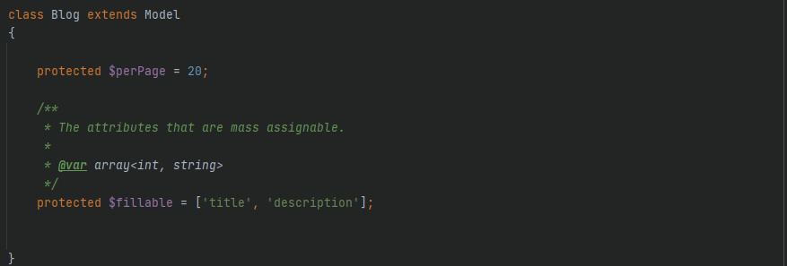
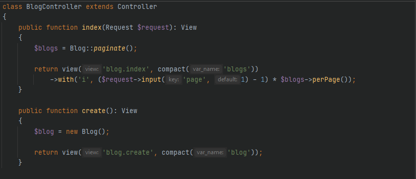
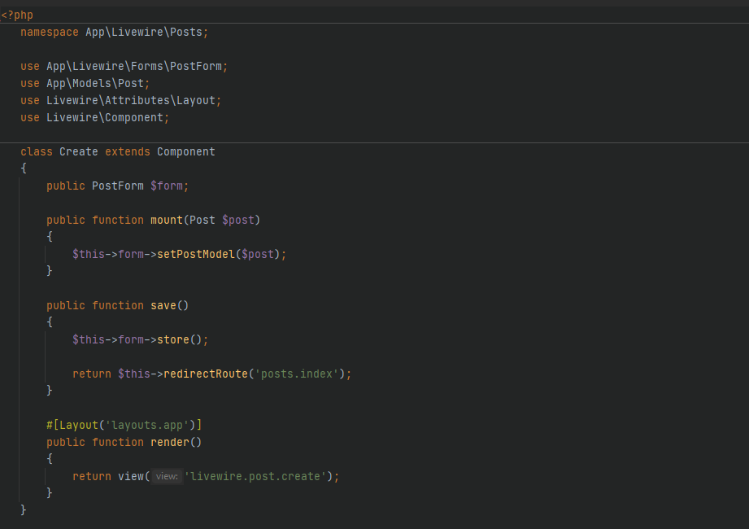
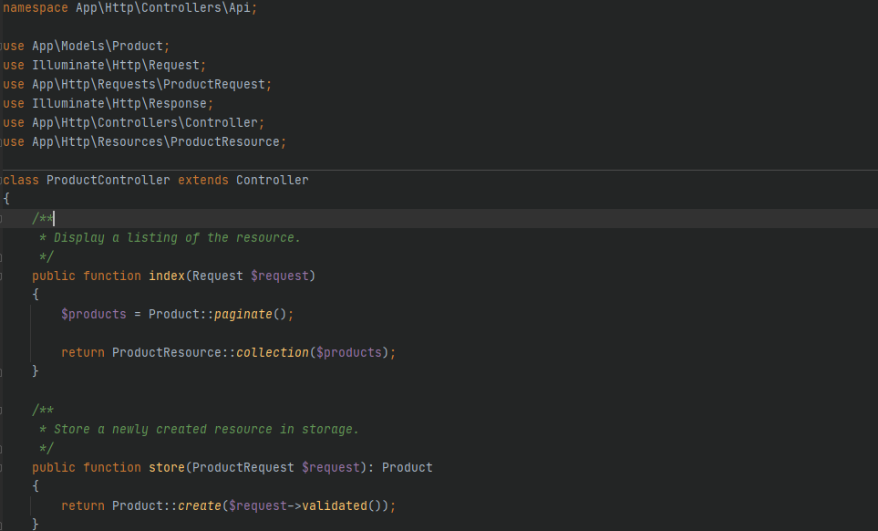
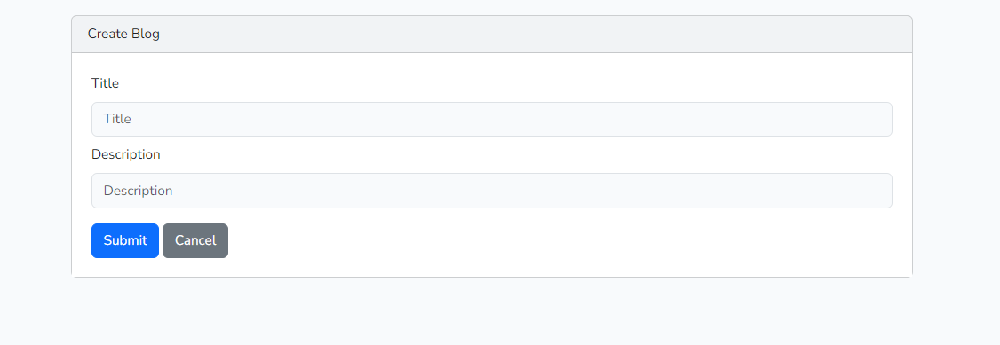

This Laravel CRUD Generator package streamlines development by generating Migration, Controllers, Models (with Eloquent relationships), and Views using a single command. It supports multiple frontend stacks, including **Bootstrap**, **Tailwind CSS**, and **Livewire** (Livewire views use **Tailwind CSS**). You can also choose an **API-only** stack for backend-focused applications.

- Will create **Model** with Eloquent relations
- Will create **Migration** with table name anf fillable attribute
- Will create **Controller** with all resources
- Will create **API Controllers** with all requests
- Will create **Component** with all resources for Livewire
- Will create **views** in Bootstrap/Tailwind

This is the best crud generator for a blank Laravel project installation too. This will auto install the starter kit [laravel/breeze](https://github.com/laravel/breeze) or [laravel/ui](https://github.com/laravel/ui) (for bootstrap 5) for blank Laravel installation.

## Requirements
    Laravel >= 10.x
    PHP >= 8.1

## Installation
1 - Install
```
composer require ibex/crud-generator --dev
```
2- Publish the default package's config (optional)
```
php artisan vendor:publish --tag=crud
```

```
composer require darshan-belani/crud-generator-laravel
```

## Usage
When creating a blog module, please ensure that the table name is set as either blogs or posts.

```
php artisan make:crud {table_name}

php artisan make:crud posts
```

Add a route in `web.php`
```
Route::resource('blogs', BlogController::class);
```

For `Livewire` add routes below
```
Route::get('/posts', \App\Livewire\Posts\Index::class)->name('posts.index');
Route::get('/posts/create', \App\Livewire\Posts\Create::class)->name('posts.create');
Route::get('/posts/show/{bank}', \App\Livewire\Posts\Show::class)->name('posts.show');
Route::get('/posts/update/{bank}', \App\Livewire\Posts\Edit::class)->name('posts.edit');
```

For `api` add routes below
```
Route::apiResource('blogs', BlogController::class);
```

Route name in plural slug case.

#### Options
- Tech Stack
  
```
php artisan make:crud {table_name} {bootstrap,tailwind,livewire,api}

php artisan make:crud blogs bootstrap  //This will create views in Bootstrap 5 using Blade
php artisan make:crud blogs tailwind   //This will create views in Tailwind css using Blade
php artisan make:crud blogs livewire   //This will create views in Tailwind css with Livewire components
php artisan make:crud blogs api        //This will create API only controllers
```
- Custom Route
```
php artisan make:crud {table_name} --route={route_name}
```


## Examples

*Model structure*




*Controller structure*




*Livewire component        *




*API only controller    *




*Tailwind CSS*


*Tailwind Form*


*Bootstrap*


*Bootstrap Form*



## Personalize
You have the possibility of 100% customizing the generated views, this is achieved in the following way:

- Run this command `php artisan vendor:publish --tag=crud` this will create the `crud.php` file in your config/ folder.
- Update the variable `stub_path`, to your own stub folder like `'stub_path' => resource_path('stubs/'),`
- Copy the stubs files from package
```
php artisan vendor:publish --tag=stubs-crud
```
- Update your changes in your stub files. (you can delete extra files/folders if you are not using them).
- Run the command for crud generation and you'll get the updated views.


## Author

Darshan Belani // [Email Me](mailto:darshan.belani9@gmail.com)

Hire Me [LinkedIn](https://www.linkedin.com/in/darshan-belani-026848114/)
